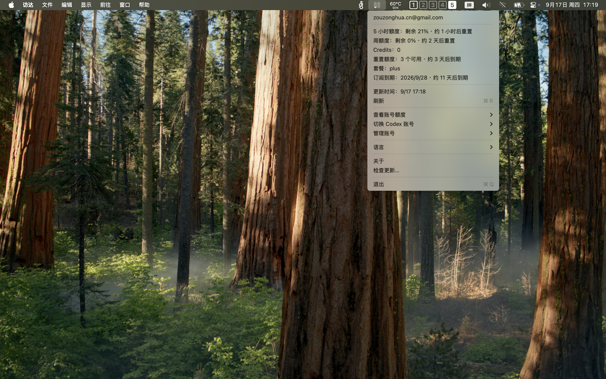

# CodexUsage

一个极简的 macOS 菜单栏应用，只做三件事：

- 查看 Codex 5 小时 / 周额度与重置时间
- 查看可用的 Codex 重置额度及最近到期时间
- 切换已保存的 Codex 账号

<p align="center">
  
</p>

## 设计取舍

- SwiftPM 原生实现，零第三方依赖，macOS 14+。
- 只读取 `~/.codex/auth.json`（或 `CODEX_HOME/auth.json`）和应用自己保存的账号目录。
- 通过 Codex OAuth 使用接口读取额度；凭据临近过期或接口返回 401 时，通过 Codex CLI 自动续期，每次查询最多续期一次、重试一次。不读取浏览器 Cookie，不打印 token。
- “查看账号额度”只改变查询对象；“切换 Codex 账号”会保存当前账号的最新凭据，再原子替换 `auth.json`，因此 Codex CLI 会同步切换。
- 添加、重新登录和续期都在应用的独立临时目录中完成，再写回对应账号；应用管理的凭据使用文件存储，不修改全局配置。

## 账号管理

- 自动续期需要支持 App Server 的 Codex CLI。失败时按提示检查网络或 CLI 版本，也可在“管理账号”中选择对应账号“重新登录…”。
- 重新登录会更新原账号；如果登录了其他账号或工作区，会保留原凭据。重复添加同一账号不会增加重复记录。
- 在终端运行 `codex login` 后，打开菜单或刷新会同步更新同一账号的已保存副本；其他账号需要分别登录。
- “管理账号 → 账号 → 删除账号…”会删除本应用保存的凭据和额度缓存。当前 Codex 使用中的账号需要先切换到其他账号才能删除。
- 登录期间可在“管理账号”中取消；取消、失败或超时均保留原凭据。
- HTTP 403 表示访问被拒绝，不会被当作登录过期；API Key 登录不支持查询 ChatGPT 订阅额度。

## 运行

```sh
swift run CodexUsage
```

## 验证

```sh
swift test
swift build
```

重置额度仅展示服务端返回的可用数量和到期时间；应用不会自动兑换或修改额度。

## GitHub Actions

向 `dev` 或 `main` 提交 PR 时会自动运行测试与构建。

合并到 `dev` 后，会根据 Conventional Commits 自动计算下一个版本，使用 GitHub Actions 运行编号生成递增的 Beta Tag（例如 `v0.2.0-beta.12`），并创建包含 DMG 与 SHA256 校验文件的 GitHub Pre-release。

使用 merge commit 将 `dev` 合并到 `main` 后，会把最新 Beta 提升为同版本号的正式 Tag（例如 `v0.2.0`），并创建 GitHub Release。不要使用 squash 或 rebase 合并。

发布任务会串行执行。等待当前 `Auto Release` 完成后，再合并下一次发布变更，避免 GitHub 取消排队中的旧任务。

Beta 版本递增规则：

- `fix:` / `perf:`：递增补丁版本
- `feat:`：递增次版本
- `BREAKING CHANGE:` 或带 `!` 的提交：递增主版本
- 其他提交：不生成新版本

首次发布使用 `Resources/Info.plist` 中的版本作为起始版本。

当前发布包仍使用 ad-hoc 签名，暂未配置 Developer ID 签名和 Apple 公证；首次打开时 macOS 可能需要在「系统设置 → 隐私与安全性」中手动允许。
